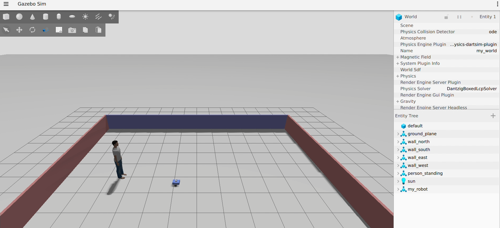
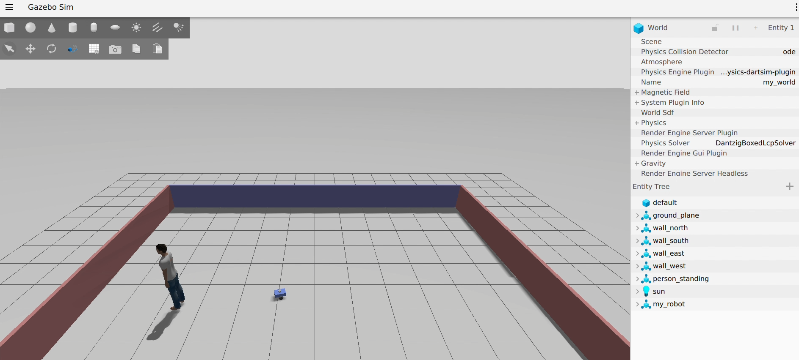
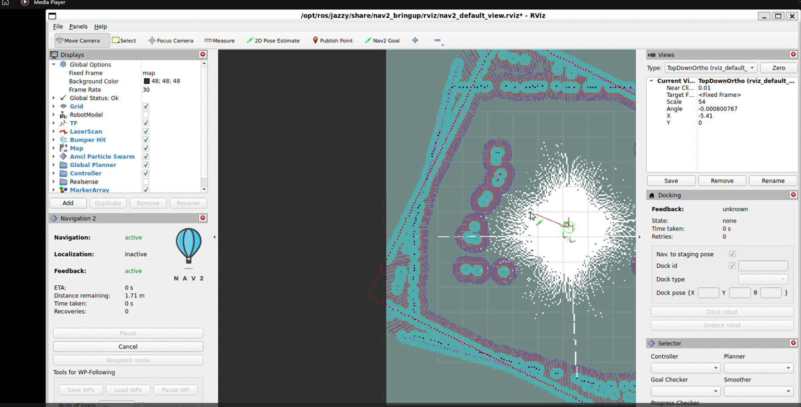
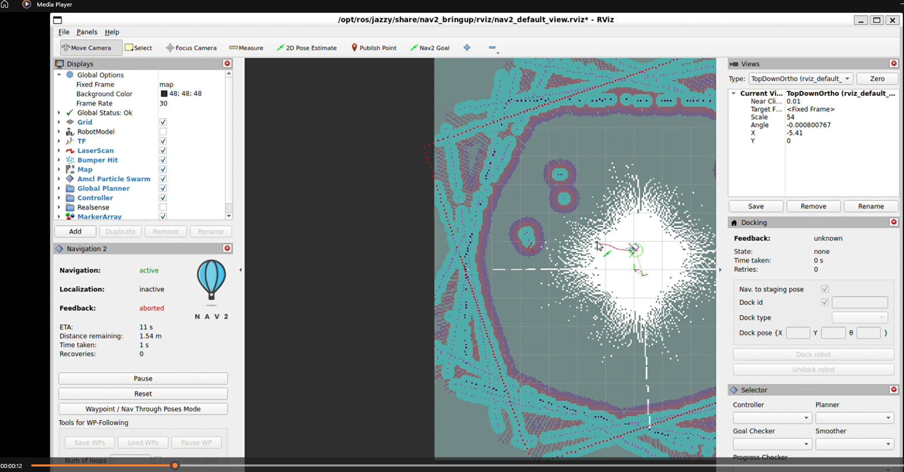

# ROS2 Predictive Autonomy Stack

A GPS-denied mobile-robot autonomy stack built in ROS2 (Jazzy), simulated in Gazebo. A differential-drive robot localizes without GPS, perceives moving people, **forecasts where they are going**, plans around those predicted paths, and runs every motion command through a **human-in-the-loop safety gate**.

The point of the project is the full pipeline working end to end: **perception → prediction → planning → safety**. SLAM is the localization backbone that makes the rest possible, not the headline.

<p align="center">
  
  
</p>

---

## The core idea: a predictive world model

Most mobile robots only react to obstacles where they are *right now*. This stack goes a step further: it maintains a **predictive world model** that tracks each moving agent and **forecasts where it will be over the next few seconds**, then plans around those future positions.

Concretely, `world_model_node.py`:

- **Tracks** every detected object across frames with a per-object Kalman filter (constant-velocity motion model, state = position + velocity), using nearest-neighbour association with a gating radius.
- **Forecasts** each track forward N steps by rolling the Kalman prediction with no new measurements. Since no measurement corrects the estimate, the covariance grows at every step, so the prediction is drawn as an **expanding cone of uncertainty** — small and confident in the near term, wide and uncertain further out.
- **Feeds planning**: the near-term, higher-confidence part of the forecast is written into Nav2's costmap, so the planner avoids where the agent is *heading*.

<p align="center">
  
  
</p>

**Why this matters**

- **Proactive instead of reactive.** The robot steers early around a person's predicted path rather than waiting until they are already in the way, which is smoother and safer around moving people.
- **Honest uncertainty.** Growing covariance is a truthful representation of prediction confidence. The planner can treat the confident near-term prediction as a firm obstacle without over-committing to the uncertain long-term tail.
- **Decoupled and reusable.** The world model consumes detections in a standard message format and publishes tracks and forecasts on their own topics. It does not care whether the detections come from a camera-LiDAR fusion node, a different detector, or ground truth — so the prediction layer can be developed, tested, and reused independently.
- **The foundation for decision-making.** Forecasts plus a safety gate turn raw perception into decisions: slow down, route around, stop, or hand control to a human. Prediction is what makes those decisions anticipatory rather than last-second.

---

## Architecture

```
Sensors (camera + 2D LiDAR + IMU + wheel odom)
        |
   Perception      camera-LiDAR fusion + YOLOv8n  ->  objects in the map frame
        |
   Localization    EKF (IMU + wheel odom) + slam_toolbox  ->  map -> odom -> base_footprint, no GPS
        |
   World model     multi-object Kalman tracking + N-step forecast with growing uncertainty   <- core
        |
   Planning        Nav2 (global plan + DWB local control), predicted paths fed into the costmap
        |
   Safety gate     proximity state machine + human approval  ->  gated velocity to the wheels
        |
   Robot           diff-drive controller (ros2_control)
```

Each stage is a separate ROS2 node wired over topics, so any piece can be swapped (for example, the Gazebo front-end could be replaced with a different simulator or a real robot feeding the same downstream nodes without changing them).

---

## What each layer does

**GPS-denied localization.** An EKF (`robot_localization`) fuses IMU and wheel odometry; `slam_toolbox` provides the map and corrects drift. No GPS anywhere in the loop.

**Perception.** `fusion_node.py` runs YOLOv8n on the camera, estimates each detection's bearing from the bounding box, reads range from the LiDAR, and publishes the object's position in the map frame.

**Predictive world model.** The centerpiece described above — tracking + forecasting with growing uncertainty (`world_model_node.py`).

**Prediction-aware planning.** `prediction_costmap_bridge.py` turns the near-term forecast into obstacles in Nav2's local costmap, so the robot routes around where a person is *going*, not only where they are now.

**Safety gate.** `safety_gate.py` sits between the planner and the wheels and runs a state machine on robot-to-person distance:

| State | Trigger | Behaviour |
|---|---|---|
| `AUTONOMOUS` | person far | pass commands through |
| `DEGRADED` | within warn radius | cap speed |
| `SAFE_STOP` | within stop radius | zero the command |
| `HOLD` | within critical radius | stop and wait for human approval |

A `HOLD` is released only after a human approves (`ros2 service call /safety/approve std_srvs/srv/Trigger`) **and** the person has left the critical zone.

---

## Tech stack

- **ROS2 Jazzy** on Ubuntu 24.04
- **Gazebo** (Harmonic) for simulation, `ros_gz_bridge` for sensor/clock bridging
- **Nav2** — global planner (NavFn) + DWB local controller, layered costmaps
- **slam_toolbox** — mapping and localization
- **robot_localization** — EKF sensor fusion
- **YOLOv8n** (Ultralytics) — camera object detection
- **NumPy** — the tracker and forecaster are self-contained (no filterpy dependency)
- **ros2_control** — `diff_drive_controller`

---

## Running it

Everything comes up with a single launch command (Gazebo, SLAM, Nav2, the perception and world-model nodes, the safety gate, and RViz, staged in the right order):

```bash
cd ~/autonomy
colcon build --symlink-install
source install/setup.bash

ros2 launch src/my_robot/launch/bringup_all.launch.py use_predictions:=true use_mover:=true
```

Launch arguments:

- `use_predictions:=true` — feed the forecast into the costmap for prediction-aware avoidance
- `use_mover:=true` — walk the simulated person along a confined path

In RViz: set an initial pose with **2D Pose Estimate**, then send goals with **Nav2 Goal**. Add the `/world_model/tracks`, `/predicted_obstacles`, and `/safety/marker` displays to see the tracking, the forecast, and the safety state (the marker is colour-coded green -> yellow -> orange -> red).

YOLO weights (`yolov8n.pt`) download automatically the first time Ultralytics runs.

---

## Repository layout

```
src/my_robot/           robot description (URDF), Gazebo world, launch files, nav2 params
src/robot_perception/   fusion_node.py (YOLO + LiDAR), vlm_node.py
tools/                  world_model_node.py           <- predictive world model (tracking + forecasting)
                        prediction_costmap_bridge.py  <- forecast -> Nav2 costmap
                        safety_gate.py                <- safety state machine + human-in-the-loop
                        cmd_vel_bridge.py, person_publisher.py, person_mover.py, auto_mapper.py
```

---

## A note on the simulation

The perception node uses YOLOv8n on the camera feed. YOLO is trained on real-world photographs, and detection on a synthetic Gazebo human model is unreliable, so for validating the **world-model, planning, and safety** layers in simulation, the tracked person's position is supplied from Gazebo ground truth (`person_publisher.py`) in the same message format the fusion node produces. This isolates those components from simulator-perception noise and lets them be tested against known input. In a real deployment the same `/fused_objects` interface is fed by the camera-LiDAR fusion node.

This is a simulation and research demonstrator, not certified robotics software.
