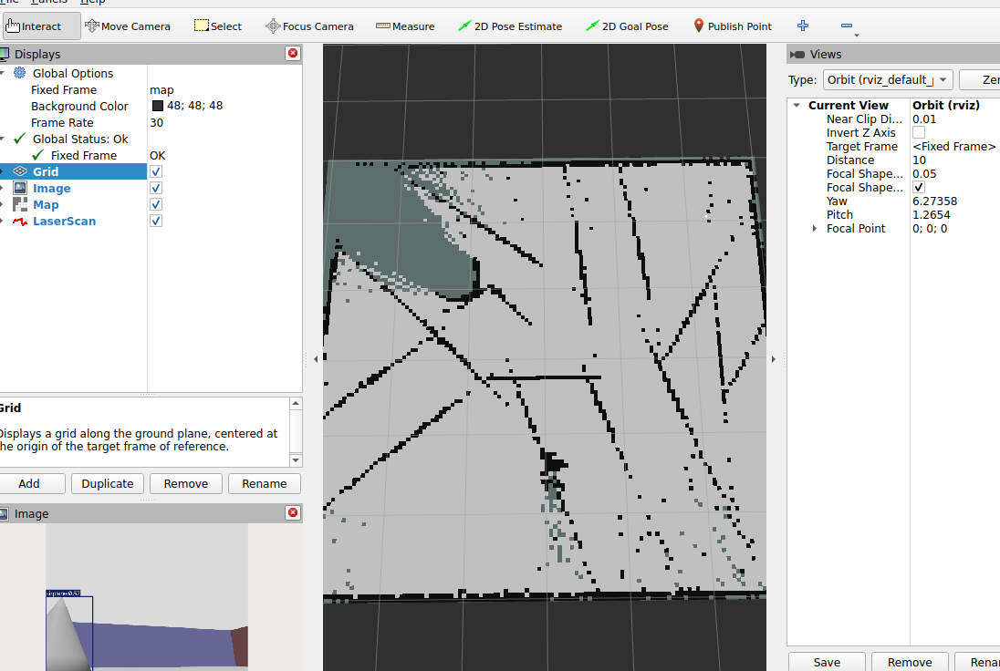
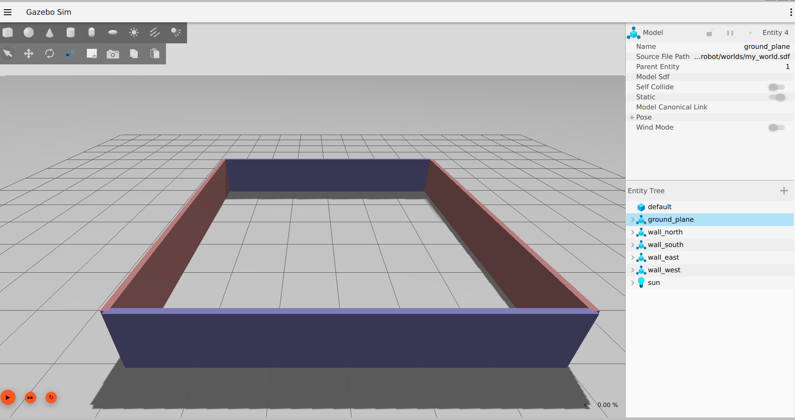

# ros2-diffdrive-slam

A differential-drive robot I built from scratch in ROS 2 to learn the full perception stack for a mobile robot: 2D LiDAR SLAM for mapping, YOLOv8n for real-time object detection, and a LLaVA vision-language model for scene understanding. Everything runs live in simulation.

Built on ROS 2 Jazzy and Gazebo Harmonic, developed on Ubuntu 24.04 under WSL2 with an RTX 2070.

## Why I built it

I wanted to actually understand a robot perception pipeline rather than just run someone else's launch file. So I started with an empty package and added one piece at a time: the robot body, the wheels, a LiDAR, the drive controller, mapping, then a camera, object detection, and finally a VLM for scene description. Each layer had to work before I moved to the next, which meant debugging the whole pipeline: TF frames, ros2_control, the Gazebo to ROS sensor bridge, SLAM, and GPU memory budgeting for the vision models.

## What it does

- A custom differential-drive robot, described in URDF and driven with ros2_control
- LiDAR SLAM that builds and saves a 2D occupancy-grid map of the room
- A camera running YOLOv8n on the GPU for real-time object detection
- A LLaVA vision-language model, served over FastAPI, that describes the robot's camera view on demand through a ROS service

## Results

The robot mapping a walled room while its camera detects a person. The left panel is the live camera feed with the YOLO bounding box; the main view is the occupancy grid being built from LiDAR.



The simulation environment: the robot, a person, and a cone obstacle inside a walled room.


The finished occupancy-grid map of the room in Gazebo alongside the SLAM output.



Example VLM output. Calling the ROS service `describe_scene` sends the current camera frame to LLaVA and publishes its answer on `/scene_description`:

> In the image, there is a person standing in the center. The person is wearing a white t-shirt and blue jeans. They are barefoot and appear to be standing on a flat surface. The background is a simple, abstract design with a gradient of colors. There are no other objects or obstacles visible.

## How it fits together

The robot is spawned into Gazebo, which simulates physics, the LiDAR, and the camera. robot_state_publisher publishes the TF tree from the URDF. ros2_control, through the gz_ros2_control plugin, runs a diff_drive_controller that turns velocity commands into wheel speeds and publishes odometry plus the odom to base_footprint transform. slam_toolbox consumes the laser scans and TF to build the map and publish the map to odom transform. In parallel, a YOLO node reads the camera and publishes detections, and a VLM node forwards camera frames to a LLaVA server on request.

Data flow: teleop publishes cmd_vel, diff_drive_controller converts it to wheel velocities, Gazebo produces /scan and /image, slam_toolbox builds /map from the scans and TF, the YOLO node produces /detections, and the VLM node produces /scene_description on demand.

## The robot

A differential-drive base built with xacro macros:

- base_footprint: ground-projected root frame
- base_link: chassis
- left_wheel, right_wheel: continuous joints, actuated by ros2_control
- caster: passive sphere for balance
- lidar_link: 360 degree laser mount
- camera_link: forward-facing RGB camera

The LiDAR is a gpu_lidar sensor: 360 samples over a full circle, 10 Hz, 10 m range. The camera is a 640x480 RGB sensor at 15 Hz.

## Perception layers

Three complementary layers, each doing what it is best at:

- LiDAR SLAM (slam_toolbox): geometry. Builds the map and localizes the robot. Runs continuously.
- YOLOv8n: fast object detection. Real-time bounding boxes for the 80 COCO classes, including people. GPU, FP16.
- LLaVA-1.6-Mistral-7B: rich scene understanding in natural language. Slow (a few seconds per frame), so it runs on demand via a ROS service, not continuously.

A note on hardware: on an 8 GB GPU, YOLO, LLaVA, and Gazebo's renderer cannot all run at full tilt at once. I profiled the VRAM usage and run detection and the VLM as two separate modes rather than concurrently. Running both together would need heavier quantization or a larger GPU.

## Running it

1. Simulation, robot, and control. The plugin-path export is required so Gazebo can find the ros2_control system plugin:

```bash
export GZ_SIM_SYSTEM_PLUGIN_PATH=/opt/ros/jazzy/lib
ros2 launch my_robot gazebo.launch.py
```

2. SLAM:

```bash
ros2 launch slam_toolbox online_async_launch.py use_sim_time:=true
```

3. Drive it. Jazzy's diff_drive_controller expects TwistStamped:

```bash
ros2 run teleop_twist_keyboard teleop_twist_keyboard --ros-args -p stamped:=true -r cmd_vel:=/diff_drive_controller/cmd_vel
```

4. Object detection:

```bash
ros2 run robot_perception yolo_node
```

5. VLM scene understanding. Start the LLaVA server (own virtual environment), then the ROS node, then call the service:

```bash
# terminal A (vlm_env active)
cd ~/vlm_server && uvicorn vlm_server:app --host 0.0.0.0 --port 8000
# terminal B
ros2 run robot_perception vlm_node
# terminal C
ros2 service call /describe_scene std_srvs/srv/Trigger
```

6. Save the map:

```bash
ros2 run nav2_map_server map_saver_cli -f ~/slam_ws/room_map --ros-args -p use_sim_time:=true -p save_map_timeout:=10000.0
```

## Things that bit me (and how I fixed them)

These cost me real time, so I am writing them down:

- teleop did nothing at first. In Jazzy, diff_drive_controller subscribes to a TwistStamped, not a plain Twist. teleop_twist_keyboard publishes Twist by default, so the robot just sat there. Fix: run teleop with -p stamped:=true.
- The controllers never loaded. The controller_manager service never came up because Gazebo could not find the gz_ros2_control system plugin library. Fix: export GZ_SIM_SYSTEM_PLUGIN_PATH=/opt/ros/jazzy/lib before launching.
- My world would not load. Passing the world through the ros_gz_sim launch include silently dropped it and Gazebo started an empty default world. Running gz sim with the world file as a direct argument fixed it.
- slam_toolbox produced no map. The bare ros2 run of the node never activated it. Its own online_async_launch.py sets it up as a lifecycle node and activates it, which is what actually starts mapping.
- A NumPy version clash broke YOLO (numpy.core.multiarray failed to import). Pinning numpy below 2.0 fixed it.
- The VLM service timed out when YOLO and LLaVA ran together. The GPU was maxed at 8 GB. Stopping YOLO freed enough VRAM for LLaVA to respond quickly.

## What I would do next

- Fuse YOLO detections into the map to produce a semantic map (labelled regions), rather than running detection and mapping in parallel.
- Fuse wheel odometry with an IMU (via robot_localization) so the pose estimate survives wheel slip.
- Layer Nav2 on top of the saved map for autonomous navigation.
- Use the VLM output to gate behaviour, for example stop or reroute when it reports a person ahead.

## Stack

ROS 2 Jazzy, Gazebo Harmonic, ros2_control, slam_toolbox, YOLOv8n (Ultralytics), LLaVA-1.6-Mistral-7B, FastAPI, xacro/URDF, Python launch files, WSL2 (Ubuntu 24.04, RTX 2070)
